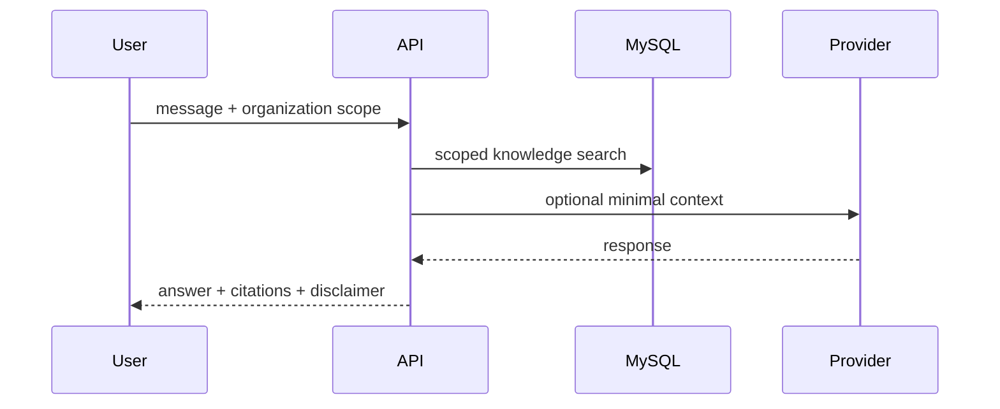
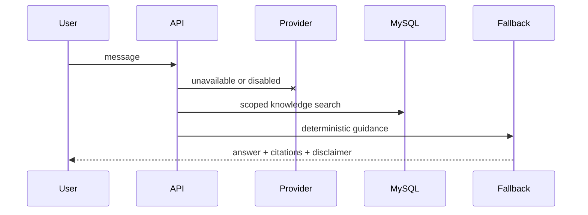

# AI providers and fallback

Core workflows never require AI. The current fallback searches only published documents from the active organization and returns deterministic HSE guidance with citations and a human-review disclaimer.





## ArvanCloud AI configuration

The production adapter is OpenAI-compatible and sends requests only from the API server to ArvanCloud AI's `chat/completions` endpoint; the API key is never exposed to the browser. Configure the two application roles independently:

```dotenv
AI_ENABLED=true
ARVAN_API_KEY=replace-with-a-secret-api-key
ARVAN_BASE_URL=https://api.arvancloudai.ir/v1
AI_RISK_PROVIDER=arvancloud
AI_RISK_MODEL=GPT-5-Mini
AI_RISK_FALLBACK_PROVIDER=arvancloud
AI_RISK_FALLBACK_MODEL=GPT-5-Mini
AI_CHAT_PROVIDER=arvancloud
AI_CHAT_MODEL=DeepSeek-V4-Flash
AI_CHAT_MAX_OUTPUT_TOKENS=900
AI_MAX_OUTPUT_TOKENS=1600
AI_PROVIDER_TIMEOUT_MS=30000
AI_PROVIDER_MAX_ATTEMPTS=2
AI_PROVIDER_RETRY_DELAY_MS=250
```

Risk-analysis requests use `AI_RISK_MODEL` (`GPT-5-Mini`). If the primary call fails or times out, `AI_RISK_FALLBACK_PROVIDER` and `AI_RISK_FALLBACK_MODEL` use the configured ArvanCloud AI credential with `GPT-5-Mini`; the deterministic, organization-scoped knowledge-base fallback remains the final path. Chat messages use `AI_CHAT_MODEL` (`DeepSeek-V4-Flash`). The authenticated `GET /api/v1/ai/providers` response identifies the configured roles and fallback model without returning credentials. Risk requests submitted without an explicit non-default provider use the complete automatic failover chain; an explicitly requested provider remains isolated to that provider.

All HTTP adapters use a bounded timeout (`AI_PROVIDER_TIMEOUT_MS`, default 30 seconds), at most two total attempts by default (`AI_PROVIDER_MAX_ATTEMPTS`, maximum three), and a capped exponential delay for transient network, rate-limit and 5xx responses (`AI_PROVIDER_RETRY_DELAY_MS`). Non-transient failures are not retried. Retry and failover errors are normalized before they are stored in AI request records, so upstream messages and credentials are not exposed to users or logs. Chat requests use a bounded knowledge context (up to three relevant documents and 900 characters per document), include up to six prior messages from the authenticated user's own conversation, and default to a 900-token output cap through `AI_CHAT_MAX_OUTPUT_TOKENS`; risk-analysis requests retain the broader context and the `AI_MAX_OUTPUT_TOKENS` setting. These limits reduce prompt and generation time while keeping the controls configurable per deployment.

Successful external-provider calls persist the provider-reported input, output and total token counts in `AIUsageRecord`, linked to the initiating user, organization and source request/message. The global administration panel reads all-user aggregates and an organization administrator reads only the selected organization's aggregates through `GET /api/v1/admin/ai-usage`; prompts, completions and credentials are not included. Calls without provider-reported usage are not estimated or counted as token consumption, and the source key makes recording idempotent across retries.

FMEA process suggestions use the same server-side risk provider and send only bounded job/process context. The API sanitizes structured arrays and description output, marks the response as connected/fallback/unavailable, and keeps the database catalog suggestions available when the external provider is unavailable. AI output is presented as a suggestion and is not written into the FMEA until the user confirms it. An alternate risk model must be configured with an identifier supported by the provider's current model catalog; no unverified model identifier is hard-coded into the application.

FMEA process-image review uses the same risk route with an OpenAI-compatible multimodal message containing the validated image data URI. Only the ArvanCloud adapter advertises image support; failover skips text-only providers when an image is present rather than silently discarding the image. The parser accepts at most six rows, bounds all text fields and requires integer S/O/D values from 1 to 10. The image itself is not included in AI usage records or audit metadata; only the MIME type, byte size, provider status and row count are recorded.

To add another provider, implement an adapter that accepts minimal scoped context, validates structured output, redacts secrets, uses the shared timeout/retry transport, and participates in the role-specific routing chain without blocking the user. API keys must remain in ignored server environment files; no frontend bundle, source file or API response contains a credential.
