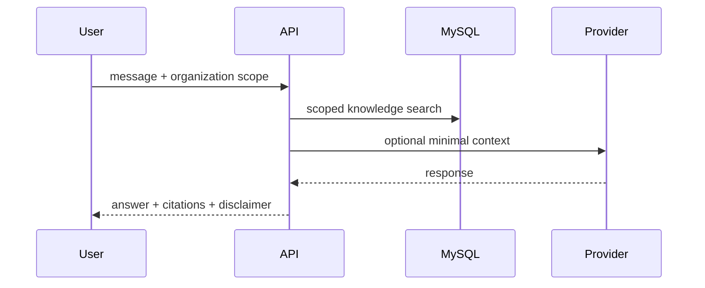
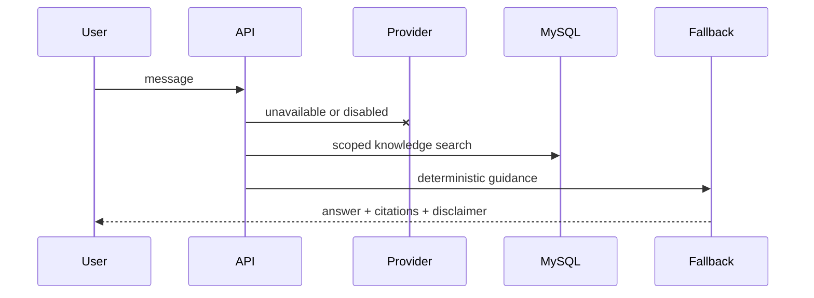

# AI providers and fallback

Core workflows never require AI. The current fallback searches only published documents from the active organization and returns deterministic HSE guidance with citations and a human-review disclaimer.

To add a provider, implement an adapter that accepts minimal scoped context, validates structured output, redacts secrets, times out, retries only transient failures and falls back without blocking the user.
