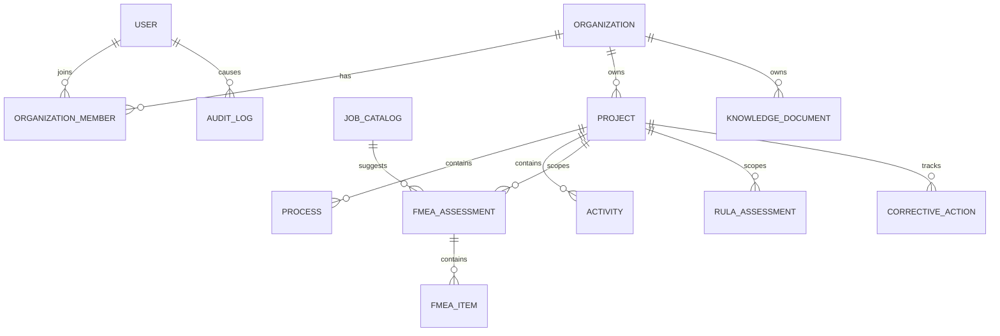

# Database

Local development uses XAMPP MySQL/MariaDB through Prisma. The schema is located at `backend/prisma/schema.prisma`.

- Database: `nivasafe`
- Host: `127.0.0.1`
- Port: `3306`
- User: `root`
- Development password: empty
- Character set: `utf8mb4`
- Collation: `utf8mb4_unicode_ci`

The development startup uses `prisma db push --accept-data-loss` because the local database is disposable test data. Production deployment must use reviewed MySQL migrations and production credentials.

UUID values are stored in `VARCHAR(36)` columns. Knowledge tags are stored as JSON arrays. Uploaded files are stored locally unless an S3 endpoint is configured.

New registration uses the existing `Organization`, `OrganizationMember` and `Project` relationships in one Prisma transaction. The organization owns exactly one initial project with code `DEFAULT`; the composite organization/code uniqueness constraint prevents duplicate default projects within that organization. The authenticated project-list read also idempotently backfills this localized starter project for older organizations and restores a soft-deleted starter, while keeping the project tenant-scoped. The project route protects the `DEFAULT` starter from deletion, and no migration is required for this onboarding behavior.

The `ASSISTANT` organization role is represented in the existing `RolePermission`, `OrganizationMember` and `Invitation` role enums. Migration `202609040001_add_assistant_role` expands those enums without removing data or changing existing membership rows; invitation acceptance assigns the selected role atomically.

Migration `202609050001_fmea_process_information` adds the searchable `JobCatalog` table and the FMEA process-information columns (`jobCatalogId`, `department`, `activityDescription`, `equipment`, `materials`, `existingControls` and `specialConditions`). The later catalog expansion migration adds common HSE, production, maintenance, logistics, laboratory, services and construction roles as global entries and adds organization/active/title indexes for the initial catalog load. Catalog entries may be global or organization-owned; the API only exposes active entries visible to the current organization. The live FMEA title field uses this database catalog only and filters it in the client, so typing titles does not consume AI tokens; the authenticated `job-titles` suggestion mode remains available for explicit compatibility callers. Existing FMEA rows remain intact because the new assessment fields are nullable for backward compatibility, while new FMEA submissions require a job/process title and activity description at the API boundary.

Migration `202609090001_ai_usage` adds the additive `AIUsageRecord` table. Each provider-reported token result is linked to its organization, initiating user and source request/message; a source unique key prevents duplicate accounting on retries. Input, output and total token counters are bounded database integers, and usage rows use restrictive user/organization foreign keys so accounting history is not silently deleted with an account.

Migration `202609050002_fmea_report_actions` adds the nullable `CorrectiveAction.fmeaItemId` foreign key and index. It uses `ON DELETE SET NULL` so a corrective-action record remains available in the report/action history when its originating failure-mode row is removed.

Migration `202609220002_rula_action_body_side` adds nullable `CorrectiveAction.bodySide`. RULA-linked actions are backfilled from their assessment scope; FMEA and standalone actions remain nullable for backward compatibility. The action API requires `LEFT`, `RIGHT`, or `BOTH` for RULA links and rejects a side that is not part of a single-side assessment.

