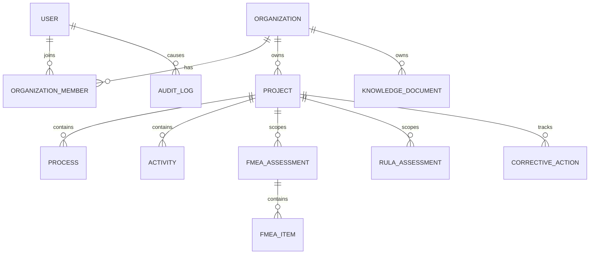

# Database

Local development uses XAMPP MySQL/MariaDB through Prisma. The schema is located at `apps/api/prisma/schema.prisma`.

- Database: `nivasafe`
- Host: `127.0.0.1`
- Port: `3306`
- User: `root`
- Development password: empty
- Character set: `utf8mb4`
- Collation: `utf8mb4_unicode_ci`

The development startup uses `prisma db push --accept-data-loss` because the local database is disposable test data. Production deployment must use reviewed MySQL migrations and production credentials.

UUID values are stored in `VARCHAR(36)` columns. Knowledge tags are stored as JSON arrays. Uploaded files are stored locally unless an S3 endpoint is configured.

